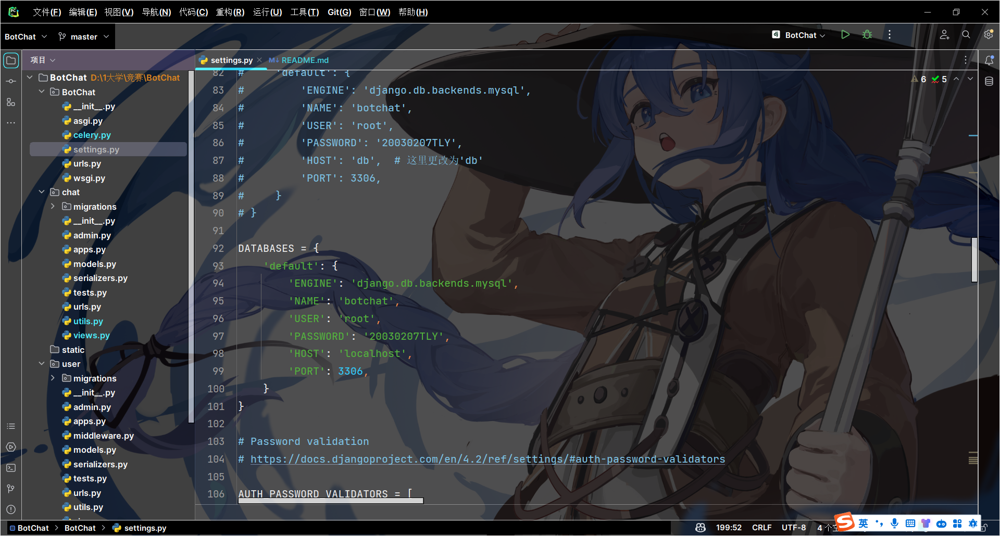
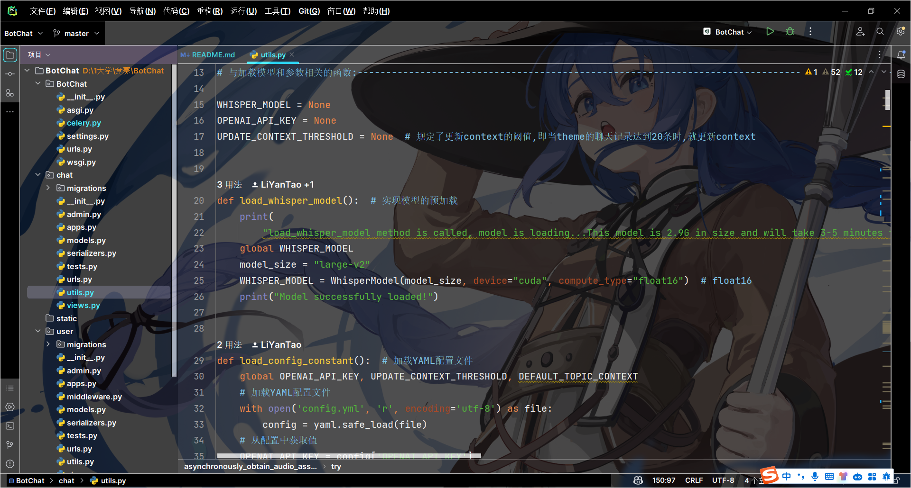

# BotChat-Backend
## 后端服务器启动流程：
### 无Docker镜像的启动流程：
1. **运行mysql服务**：保证本地的mysql服务已经启动,同时保证Botchat包下的settings.py中的数据库配置信息与本地的mysql服务配置信息一致


2. **启动Redis服务器(一定要在启动celery前完成)**：非Windows操作系统的使用者可以在本地通过命令行的方式在6379端口上运行Redis;Windows用户可以安装并使用Docker下载Redis镜像并在6379端口上运行Redis容器:
```shell
docker pull redis
docker run -p 6379:6379 --name redis -d redis 
```

3. **启动celery服务器(一定要在启动Django服务器前完成)**：在BotChat后端项目的根目录下运行命令行以启动celery服务器
```shell
celery -A BotChat worker -l info -P solo -Q production,celery -n worker1
```

4. **启动Django服务器**：在BotChat后端项目的根目录下运行命令行以启动Django服务器
```shell        
python manage.py runserver 0.0.0.0:80
``` 
注意:首次运行Django后端服务器时,由于会远程拉取下载faster-whisper模型,因此需要等待3-5分钟;此外,请确保在启动Django服务器前已经下载了适配于自己显卡版本的CUDA和GPU版本的Pytorch(强烈推荐从官网下载而非从pip镜像源处直接下载);如果你不是N卡,可能会遇到关键词为"float16"的报错,可以尝试将chat包下的utils.py中的load_whisper_model()函数中的"float16"更改为"float32"来解决:


### 使用Docker打包该项目为镜像的启动流程：
1. **安装CUDA和英伟达显卡驱动**：本项目依赖于openai开源的whisper模型,因此需要CUDA和N卡驱动的支持
2. **安装Docker**：请安装19.03版本以上的Docker(19.03版本以下的Docker没有集成NVIDIA-Docker,因此无法调用宿主机(即本地)上的CUDA和显卡驱动)
3. **施工中**：

## 项目用途：
该项目是一个用于帮助以中文为母语的人学习英语口语的Web项目。用户可以输入语音或文字，系统会自动转换成英语，并以英语语音的形式输出，以帮助用户提升他们的英语口语能力。

## 项目运作流程：

1. **用户登录与注册**：用户可以注册并登录到自己的账号

2. **选择对话**：用户可以从自己的历史聊天中选择一个对话来继续问答;用户也可以选择新建一个对话来开启问答

3. **用户输入**：用户可以选择语音或文字方式输入

4. **前端处理**：前端接收用户的语音/文本并传递到后端

5. **语音转文本**：如果后端接收到语音，后端调用Whisper语音库(现采用faster_whisper库)将语音转为文本

6. **呈现用户的提问**：将用户刚刚输入的文本(或语音转成的文本)发送到前端页面并进行呈现

6. **与openAI服务器进行交互**：在前端页面呈现了用户刚刚输入的文本后,将该文本通过HTTP请求发送到openAI的服务器并得到模型的响应

8. **呈现bot的回答**：后端将得到的响应结果呈现到前端页面

9. **输出语音**：在前端页面呈现了bot的回复后,后端调用tts库来讲回复的文本转为语音并递交给前端

## 项目需求:

### 1.主要功能：

1. **用户的登录和注册**：允许用户在本网站的注册和登录

2. **创建新对话**：用户可以选择创建全新的对话

3. **选择历史聊天对话**：用户可以从历史聊天对话中选择一个chat来继续对话

4. **用户语音/文本输入**：用户在选择好对话后可以进行语音或文本的输入

5. **用户文本/语音转文本呈现**：后端处理完用户的输入内容(语音/文本)后将用户的提问内容传递给前端页面,前端页面对该文本进行呈现

6. **与openai服务器交互**：前端页面将接收到的文本（直接输入或转换得来）发送到后端,视图函数通过HTTP请求发送到openAI的远程服务器并得到模型的响应

7. **输出交互结果**：后端在得到响应结果后向前端输出与openai服务器交互得到的文本以及该文本转为语音后的数据

### 2.额外功能：

1. **重复播放**：用户可以点击按钮重复播放语音信息

2. **显示隐藏文本**：如果用户没能听懂语音答复，他们可以选择展示被隐藏了的文本答复

### 3.开发需求概括：

1. 开发支持文本和语音输入的用户接口

2. 集成Whisper语音库，从语音输入中提取文本

3. 实现与openAI服务器进行HTTP通信的功能

4. 实现从openAI服务器获取chatGPT的英文答复文本的功能

5. 集成语音合成库，将英文文本答复转换为英文语音

6. 开发将英文语音和对应的英文文本输出到前端的功能

7. 开发允许用户重复播放相同语音信息的功能

8. 开发允许用户选择显示隐藏文本的功能

## 数据库设计:

### 1.user表：
采用Django自带的auth_user表

### 2.topic表(将原records表进行拆分后得到)：
1. id
2. user_id
3. theme
4. context

### 3.conversation表(将原records表进行拆分后得到)：
1. id
2. topic_id
3. created_time
4. prompt
5. response
### 表关系:
user与topic一对多;topic与conversation一对多